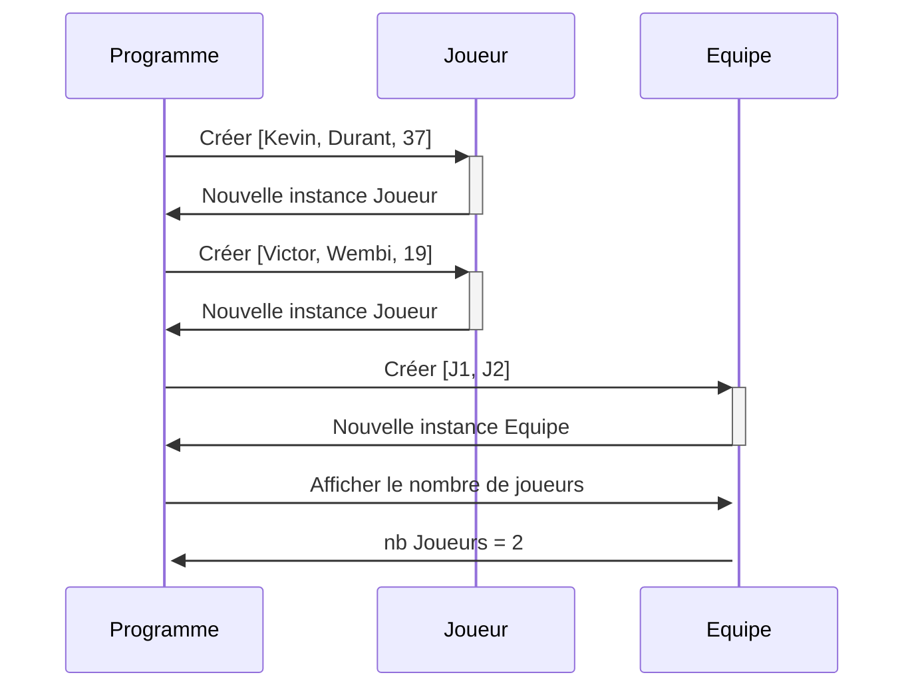

# Projet initial pour vos exercices d'algorithmie en typescript

## Installation

1. Clonez le projet
```bash
cd ~/dev
mkdir poo
cd poo
git clone git@github.com:ThomasLaforge/poo-setup-simplon.git poo-template
```
2. Déplacez vous dans le dossier cloné
```bash
cd poo-template
```
3. Supprimez le dossier `.git`
```bash
rm -rf .git
```
3. installez les dépendances
```bash
npm install
``` 
4. Lancez le projet
```bash
npm run dev
```
5. Modifiez le fichier `src/index.ts` pour commencer à coder

## Diagramme de sequence ##

